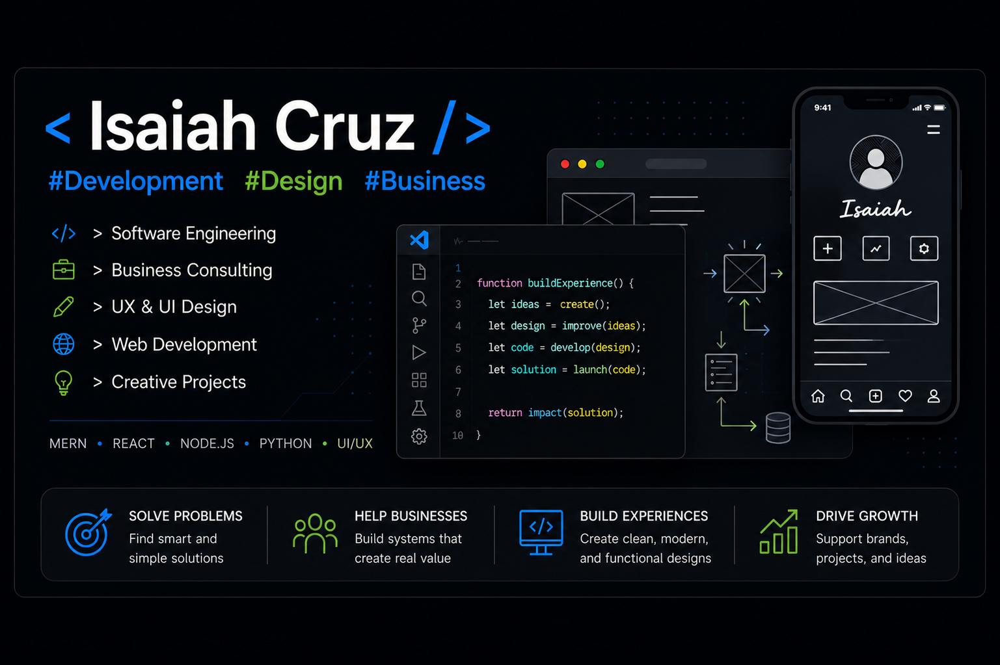

### Hi there! Welcome to my Github page! My name is Isaiah and I'm a Software Developer. Coffee and Code is my life motto. I have dipped my feet in many programming languages and fell in love with the MERN stack.

<kbd><strong>[⁉️ Ask me anything](https://github.com/isaiahcruz70/isaiahcruz70/issues/new?assignees=isaiahcruz70&labels=ama&template=ama.md&title=%5BAMA%5D)</strong></kbd>

- 🏗️ I'm currently working on growing more as a solo developer
- 🌱 I’m currently learning MERN stack
- 👯 I’m looking to collaborate on anything that will challenge my knowledge and help me to grow as a better software engineer
- 💬 Ask me about anything! I'm an open book
- 📫 How to reach me: [isaiahcruz.dev](https://isaiahcruz70.github.io/my-portfolio/) or Email: Isaiahcruz70@gmail.com
- 🐦 I'm on Twitter [https://twitter.com/isaiahcruz70](https://twitter.com/isaiahcruz70)
- ⛓️ ... and LinkedIn [https://www.linkedin.com/in/isaiahcruz/](https://www.linkedin.com/in/isaiahcruz/)
- ⚡ Who am I?: I was raised by a single mom who, despite all the struggles she faced, always pushed me to become the best version of myself. Watching her work hard taught me resilience, discipline, and the importance of believing in yourself even during difficult times.

My passion for technology began when my pastor, who worked in software development, introduced me to the world of coding. Through him, I was introduced to the beautiful staff of [Bitwise](https://bitwiseindustries.com/), which completely changed the direction of my life. Soon after, I began taking classes at [Geekwise](https://bitwiseindustries.com/services/workforce-training/classes/), where I developed a strong foundation in programming, problem-solving, and teamwork.

Since then, I’ve continued growing both technically and professionally. I’ve worked on projects for churches and community organizations, helping create digital solutions while learning how technology can positively impact people’s lives. Alongside my technical growth, I’ve also been studying business and leadership, building skills in communication, management, organization, and entrepreneurship. These experiences have taught me not only how to create technology, but also how to lead projects, work with teams, and build meaningful solutions for others.

My main goal in life is to become a full-time software engineer at a company that values my presence, encourages growth, and allows me to make a positive impact. More importantly, I want to help troubled youth and show them the amazing world of code, just like others once showed me.

---

### :fire: My Stats :

---

### :hammer_and_wrench: Languages and Tools :

  &nbsp;
  &nbsp;
  &nbsp;
  &nbsp;
  &nbsp;
  &nbsp;
  &nbsp;
  &nbsp;
  &nbsp;
  &nbsp;
  &nbsp;
  
  

